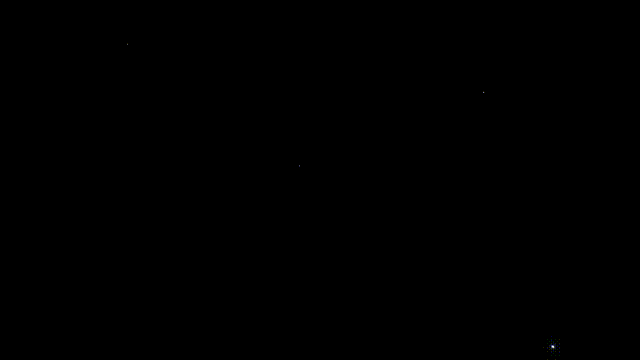

# Bubble Chamber BPy

Bubble chamber simulation in Blender + Python

A spiritual successor to
[my previous 2D project written in Rust+Amethyst]_(https://github.com/OliverHofkens/bubble_chamber),
this time written in Python and rendering in 3D with [Blender](https://www.blender.org/).
It simulates the phenomena that occur in
[bubble chambers](https://en.wikipedia.org/wiki/Bubble_chamber) or
[cloud chambers](https://en.wikipedia.org/wiki/Cloud_chamber) where decaying,
charged particles leave spiraling trails as they move through a magnetic field.

## Requirements

* Blender 2.80 or higher

## Installation

* Clone the repository and run `pipenv install` inside the project.

## Usage

* Run `blender -P <path_to_repo>/bubble_chamber_bpy/blender.py`
* The simulation should run and Blender should open up with a fully populated
  scene + animations
* Hit 'Render Animation' or play around with the scene/animations.

## Development

### Environment Setup

* Clone this repository
* `cd bubble_chamber_bpy`
* Run `pipenv install --dev`

### Tests & Linting

* Run `make lint` to run linting and type checking.
* Run `make test` to run tests.
* Run `pipenv run tox` to do the above in dedicated environments and across all configured Python versions.
